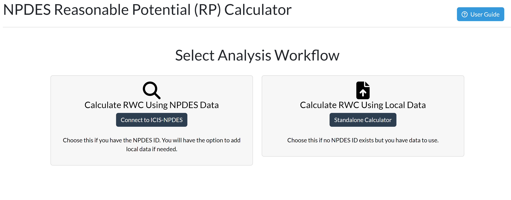
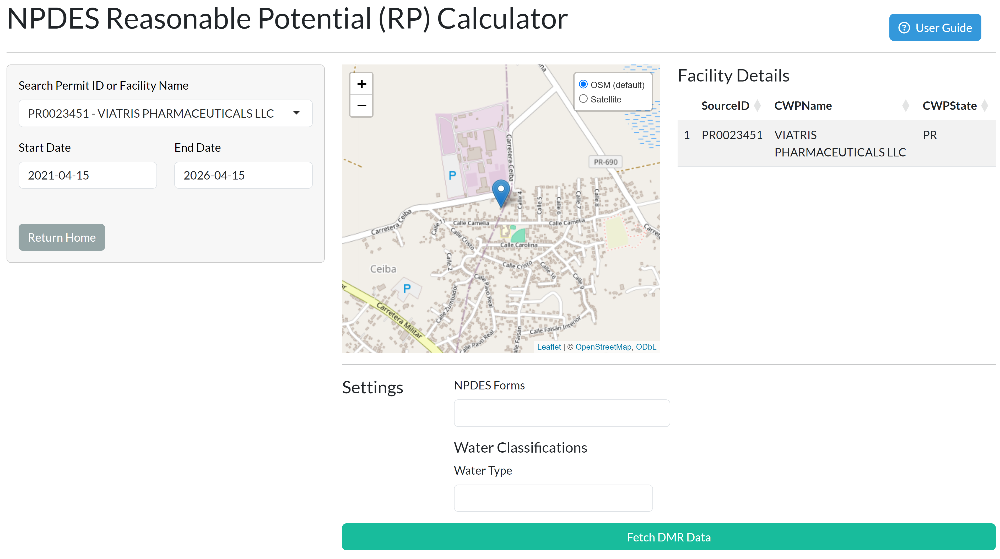
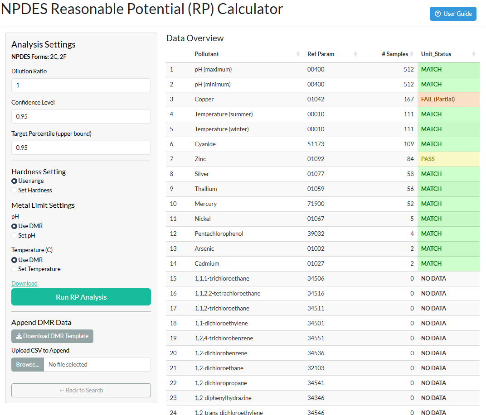
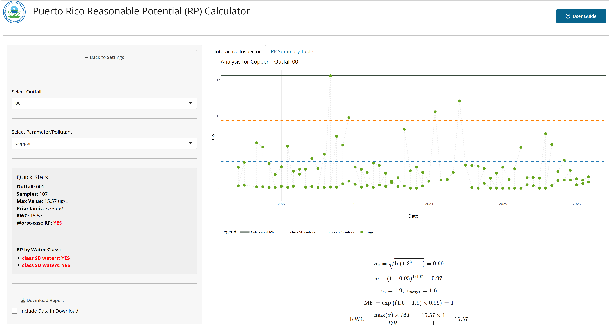
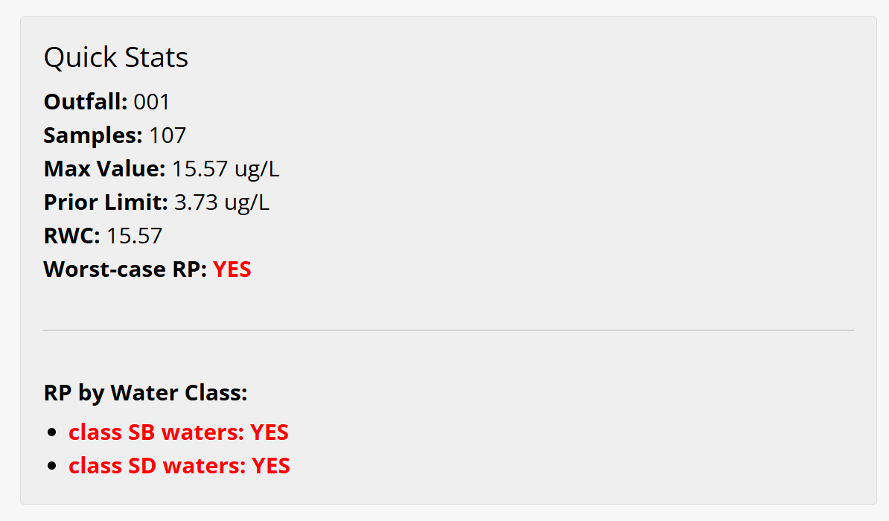
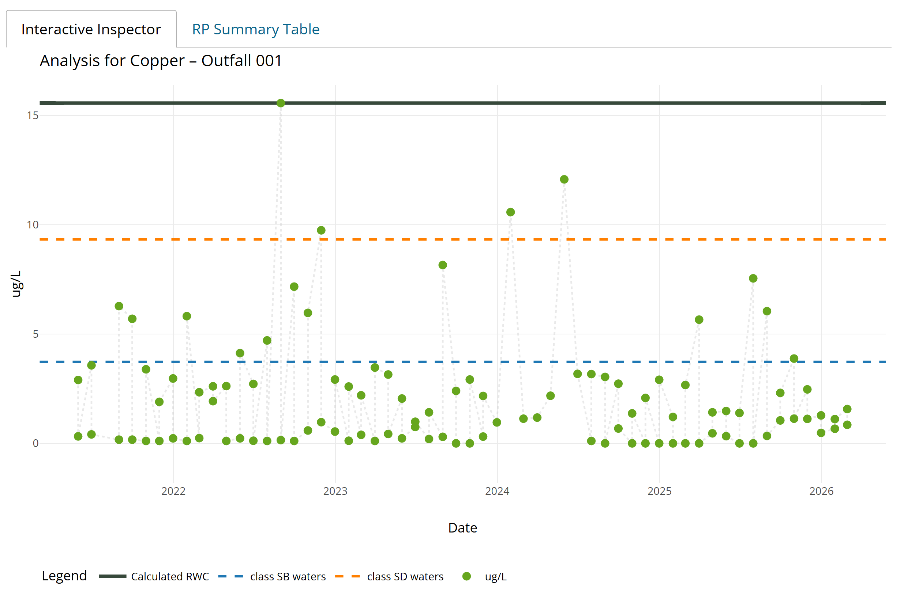
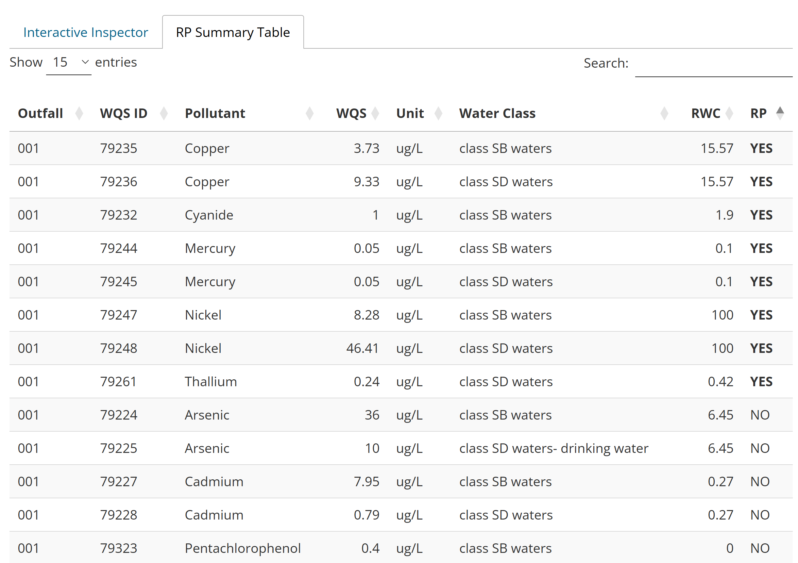

# Overview {#sec-overview}

The **Puerto Rico Reasonable Potential (RP) Calculator** is a web-based application designed to support EPA Region 2 permit writers in determining whether reasonable potential (RP) exists for an NPDES-permitted discharge to cause or contribute to an exceedance of Puerto Rico's water quality standards (WQS). The application automates the most data-intensive steps of the RP analysis: retrieving effluent monitoring data from a local copy of EPA's ICIS-NPDES database (refreshed on a weekly schedule), aligning those data with the applicable Puerto Rico WQS, performing the statistical projection described in the EPA Technical Support Document for Water Quality-Based Toxics Control (TSD, 1991), and generating a documented, reproducible PDF report.

The application is scoped to **Puerto Rico NPDES permits** and references the **Puerto Rico Water Quality Standards Regulation (PRWQSR), as amended April 2025** (DNER Resolution R-25-006). All numeric criteria, water classifications, and hardness-dependent metal limits applied by the app are drawn directly from that regulation.

## What the App Does {#sec-what-it-does}

For each pollutant and outfall combination at a selected facility, the app:

1. Retrieves maximum-statistic DMR values from the local ICIS-NPDES database (and, for pH, the minimum statistic as well), or accepts locally supplied data
2. Converts reported units to WQS units where necessary
3. Calculates a **Receiving Water Concentration (RWC)** using the statistical multiplying factor (MF) method from TSD Section 3.3.2
4. Compares the RWC to the applicable criterion from the PRWQSR for each selected water classification
5. Returns a YES / NO / DEPENDS RP determination for each pollutant × outfall × water class combination
6. Generates a PDF report — and optionally a ZIP package with supporting data — that documents all inputs, settings, and findings

## What the App Does Not Replace {#sec-limitations}

The app is an analytical aid, not a substitute for permit writer judgment. It does not:

- Perform whole effluent toxicity (WET) analysis
- Calculate waste load allocations (WLAs) or mixing zone analyses
- Account for background receiving water concentrations
- Evaluate narrative water quality criteria
- Replace the fact sheet or other permit development documentation requirements

When the app returns a YES RP finding, the permit writer must still determine the appropriate effluent limitation based on the applicable water quality standard, the dilution ratio, and any mixing zone authorization. When it returns NO, that finding is based on the statistical projection alone and should be considered alongside other factors described in 40 CFR 122.44(d)(1).

---

# Regulatory Background {#sec-background}

## Reasonable Potential Under the Clean Water Act {#sec-rp-background}

Under 40 CFR 122.44(d)(1)(i), NPDES permits must include effluent limits for pollutants that are or may be discharged at levels that will cause, have the reasonable potential to cause, or contribute to an excursion above any applicable water quality standard. Determining whether a discharge has "reasonable potential" is therefore a required step in permit development for any parameter that is monitored at an outfall.

EPA's 1991 Technical Support Document for Water Quality-Based Toxics Control (TSD) provides the recommended methodology for making this determination using effluent monitoring data. The core question is whether the upper bound of the expected effluent concentration distribution, projected into the receiving water accounting for dilution, could exceed the applicable criterion. The statistical approach in the TSD uses the coefficient of variation (CV) of the effluent data and the number of samples to construct this projection without assuming a specific distributional form for the effluent — though the lognormal distribution is used as the basis for the multiplying factors.

## The Puerto Rico Water Quality Standards Regulation {#sec-prwqs}

The PRWQSR, administered by Puerto Rico's Department of Natural and Environmental Resources (DNER), establishes the water quality standards that NPDES permits in Puerto Rico must protect. The regulation classifies Puerto Rico's waters by designated use and sets numeric criteria for a wide range of pollutants. The 2025 amendment (Resolution R-25-006, effective June 27, 2025) is the currently applicable version.

The standards that drive RP determinations fall into three main categories as implemented in the app:

- **Fixed numeric criteria** — a single concentration limit for a given pollutant and water classification (e.g., arsenic in Class SB at 36 µg/L)
- **Hardness-dependent criteria** — applicable to seven metals in Class SD waters; the criterion is computed from the receiving water hardness using regression equations specified in Rule 1303.1(J)(1) (see @sec-metals)
- **Condition-dependent criteria** — applicable to Total Ammonia Nitrogen (TAN) in Class SD waters; the criterion varies with receiving water pH and temperature as specified in Rule 1303.2(C)(2)(l) (see @sec-tan)

## Water Classifications Relevant to NPDES Permitting {#sec-classifications}

The PRWQSR classifies Puerto Rico's waters into several categories. The app includes the four classifications most relevant to NPDES point source discharges. Understanding these classifications is important because the applicable criterion — and therefore the RP determination — differs by classification.

**Class SB — Coastal and Estuarine Waters**
Class SB encompasses all coastal and estuarine waters of Puerto Rico not designated as the more protective Class SA (which includes the bioluminescent lagoons and other waters of exceptional ecological value where point source discharges are not permitted). Class SB extends from mean sea level to a maximum of approximately 10.35 miles offshore and includes associated wetlands. Designated uses include primary and secondary contact recreation, and propagation and maintenance of desirable species including threatened and endangered species. Most NPDES-permitted facilities discharging to coastal waters in Puerto Rico discharge to Class SB receiving waters.

**Class SD — Surface Waters**
Class SD covers all surface waters of Puerto Rico — streams, rivers, lakes, reservoirs, and inland water bodies — except those designated as the more protective Class SE (Laguna Tortuguero and Laguna Cartagena). Designated uses include use as a raw source of public water supply, propagation and maintenance of desirable species, and primary and secondary contact recreation. Class SD criteria are generally more stringent than Class SB for most parameters because of the drinking water supply designation. Several criteria under Class SD depend on receiving water hardness (for metals) or on pH and temperature (for TAN). In addition, three parameters — total nitrogen, total phosphorus, and selenium — carry **separate criteria depending on whether the receiving water is a stream or a reservoir/lake**. The app reports these as distinct water-class lines (e.g., *class SD waters — stream* vs *class SD waters — reservoir/lake*) so the permit writer can see which receiving-water type drives a finding.

**Class SG — Ground Waters**
Class SG includes all ground waters of Puerto Rico, including those that discharge into coastal, surface, and estuarine waters. Designated uses are drinking water supply and agricultural use including irrigation. Ground water criteria are typically the drinking water (DW) or human health (HH) values, whichever is more stringent given the receiving water body into which the ground water flows.

**Surface Waters (general)**
In the app's water type filter, "Surface Waters" maps to the PRWQSR's general surface water standards (Rule 1303.1) that apply across all surface water classifications, as distinct from the class-specific criteria under Rule 1303.2.

::: {.callout-note}
**Selecting water classifications in the app:** The water classification selection in the app determines which WQS rows from the crosswalk are active for both data filtering and RP comparison. Selecting multiple classifications will produce RP determinations for each class independently — the app reports a "worst-case" RP across all selected classes, as well as the per-class breakdown. When in doubt about which classification applies to a receiving water body, consult the PRWQSR classification maps (Rule 1302) or contact the DNER Water Quality Program.
:::

---

# Getting Started {#sec-getting-started}

## Two Workflows at a Glance {#sec-workflows}

The app offers two entry points depending on whether the facility appears in the local ICIS-NPDES database.

| | **NPDES Workflow** | **Standalone Workflow** |
|---|---|---|
| **Best for** | Existing permitted facilities | New permits, reissuances with no prior ID, or supplementing the database with local measurements |
| **Data source** | Local ICIS-NPDES database (weekly refresh) | User-supplied CSV using the app's template |
| **Requires** | NPDES permit ID | Completed DMR template |
| **Can supplement with local data** | Yes — via the Append DMR function | N/A — local data is the primary source |

Both workflows share the same Analysis Settings, Findings, and Report pages. The only difference is how effluent data are loaded.

## Navigating the App {#sec-navigation}

The app uses a single-page layout with page routing. A persistent top bar appears on every page with a **← Back to Start** button (returns to the landing page) and a **User Guide** button (opens this document in a modal window). Within each page you also move using contextual buttons (e.g., "← Back to Search," "← Back to Settings," "Return Home").

---

# NPDES Workflow {#sec-npdes-workflow}

Use this workflow when the facility has an active NPDES permit and effluent monitoring data available in the local ICIS-NPDES database.

## Step 1: Search and Select a Facility {#sec-select-facility}

Click **Connect to ICIS-NPDES** on the landing page. This opens the facility selection page, which loads the list of NPDES permits for Puerto Rico from the local ICIS-NPDES database at application startup.

Use the **Search Permit ID or Facility Name** box to find the facility of interest. You can type either the NPDES ID (e.g., `PR0001031`) or any part of the facility name — the search is case-insensitive and matches partial strings. Select the facility from the dropdown.

Once a facility is selected:

- The **map** displays a marker at the facility's reported latitude/longitude from the facility record in the local database
- The **Facility Details** table displays key permit attributes from the facility record in the local database
- The **Settings** panel and **Fetch DMR Data** button become visible

Set the **date range** for DMR retrieval using the Start Date and End Date inputs. The default range is the five years prior to today's date, which is appropriate for most permit reissuances. The date range controls which DMR records are pulled from the database — it does not filter the facility list.

::: {.callout-note}
**Selections persist within your session:** If you navigate away from the search page and return — for example, to revise a search — your permit ID, date range, NPDES forms, and water classification are retained. These reset only when the app is restarted. Analysis Settings on the Summary page (hardness, pH, temperature, dilution ratio, confidence level) are not persisted, because they re-select naturally when a different permit is fetched.
:::

## Step 2: Configure Filters {#sec-configure-filters}

Before fetching data, configure the two filters that control which parameters and WQS criteria are included in the analysis.

### NPDES Forms {#sec-npdes-forms}

Select one or more **NPDES application forms** from the multi-select dropdown. NPDES applications require permittees to report specific pollutants depending on the type of facility and the nature of the discharge. The forms available in the app correspond to the standard EPA application forms:

- **Form 2A** — New and existing publicly owned treatment works (POTWs)
- **Form 2B** — Concentrated Animal Feeding Operations (CAFOs)
- **Form 2C** — Existing manufacturing, commercial, mining, and silviculture facilities
- **Form 2D** — New manufacturing, commercial, mining, and silviculture facilities
- **Form 2E** — Facilities that do not discharge process wastewater

The form selection serves two purposes. First, it defines the **universe of pollutants** that are expected to be reported for the facility — this determines which pollutants are highlighted in the Data Overview (Coverage Summary) table. Second, it controls **display**: the form association is shown in the Coverage Summary's **Form** column and in the report's *Reason Included* line. Form selection no longer removes parameters from the analysis — any parameter with DMR data and an applicable WQS criterion is evaluated for RP regardless of form association. Parameters not associated with a selected form are labeled *Not in selected forms* in the Form column but are still included in the calculation.

::: {.callout-tip}
**Selecting the right form:** If you are unsure which form applies, refer to the facility's permit application or its permit record. Most municipal wastewater treatment plants use Form 2A. Most industrial and manufacturing dischargers use Form 2C or 2D. When multiple forms apply (e.g., a POTW receiving industrial pretreatment discharges), select all applicable forms.
:::

### Water Classifications {#sec-water-type-filter}

Select one or more **water classifications** from the multi-select dropdown. The choices correspond to Puerto Rico's PRWQSR classifications described in @sec-classifications:

| Selection | Maps to PRWQSR Classification |
|---|---|
| All | All classes in the crosswalk |
| Class SB | Class SB coastal and estuarine waters |
| Class SD | Class SD surface waters (including drinking water subclass) |
| Class SG | Class SG ground waters |
| Surface Waters | General surface water standards |

These selections determine which WQS criteria rows are active for comparison. When multiple classifications are selected, the app performs the RP comparison independently for each class and reports the worst-case result. Select **All** to evaluate against every applicable standard in the crosswalk — this is appropriate when the receiving water classification is uncertain or when you want to be comprehensive.

::: {.callout-important}
**Class SD and hardness-dependent criteria:** If **Class SD** is selected, the conditional receiving water inputs panel will appear (see @sec-hardness-settings). You will need to provide a hardness value or choose the range analysis option before running RP. This panel is only shown for Class SD because the hardness-dependent metal criteria and the TAN criterion are specific to Class SD surface waters under the PRWQSR.
:::

## Step 3: Fetch DMR Data {#sec-fetch-dmr}

Click **Fetch DMR Data**. The app queries the local ICIS-NPDES database for effluent monitoring records matching the selected permit ID and date range, then applies the following processing steps automatically:

**NODI code handling:** Records with NODI codes B ("no discharge") or Q ("no discharge this period") are set to a value of zero. This is consistent with the approach in the TSD — a period of no discharge represents a zero concentration and should be included in the sample set. Records with other NODI codes that prevent a numeric value from being reported are excluded.

**Unit detection and filling:** DMR reports occasionally omit unit labels for individual records, particularly for NODI-coded rows. The app attempts to fill missing units by: (1) using the most frequently reported unit for that parameter across all records from the permit, and (2) falling back to the WQS unit hint from the crosswalk if all records for the parameter have missing units.

**Unit conversion:** Each reported value is checked against the WQS unit for its parameter. The converter handles concentration conversions (µg/L ↔ mg/L, ng/L → µg/L/mg/L, ppm → mg/L/µg/L), recognizes several units that are written differently but mean the same thing (e.g., ICIS long-form bacteria and color units), and converts Fahrenheit to Celsius for temperature. Mass-load and flow units (e.g., kg/d, MGD, Cubic Meters per Day) are **excluded** from the WQS comparison by design rather than treated as errors. When a parameter has no WQS criterion for the selected water class, its records are flagged **NO WQS**. A genuinely unrecognized unit is flagged **FAIL** and the value is retained at face value. Every status is shown in the Coverage Summary and carried into the report. See the Unit Status table in Step 4.

After a successful fetch, the app navigates to the **Summary (Data Overview) page**.

## Step 4: Review the Data Overview {#sec-data-overview}

The Data Overview page displays the **Coverage Summary** table, which lists the pollutants relevant to this analysis — those associated with the selected NPDES forms plus any additional parameters that have DMR data — alongside a count of available DMR samples and a unit conversion status indicator. Parameters not associated with a selected form are marked *Not in selected forms* in the Form column.

**Understanding the Coverage Summary columns:**

| Column | Description |
|---|---|
| Pollutant | NPDES pollutant name from the form crosswalk |
| Form | The NPDES application form(s) that require this pollutant |
| Ref Param | The DMR parameter code(s) matched to this pollutant in the crosswalk |
| # Samples | Count of qualifying DMR records retrieved for this permit and date range |
| Unit Status | Result of the unit conversion check (see below) |

**Unit Status values:**

| Status | Meaning | Action |
|---|---|---|
| MATCH | Reported units already match the WQS unit (including recognized aliases) — no conversion needed | None required |
| PASS | Units differed but a multiplicative or temperature conversion was successfully applied | Conversion is shown in the report |
| FAIL (Partial) | Some eligible records converted successfully but others could not | Proceed with caution; non-convertible records are dropped from the RP calculation |
| FAIL | No eligible record could be converted to the WQS unit (unrecognized unit) | Investigate the DMR data; values are retained at face value but dropped from RP |
| EXCLUDED | Every record is a mass-load or flow unit (e.g., kg/d, MGD) | Informational — these cannot be compared to a concentration criterion and are excluded by design |
| NO WQS | No WQS criterion exists for this parameter in the selected water class | Informational — see the **Needs Attention** tab to add a manual criterion if appropriate |
| NO DATA | Parameter is in the crosswalk but had no DMR records | Informational — nothing to evaluate |

EXCLUDED, NO WQS, and NO DATA are informational, not errors; they are color-coded distinctly (grey / blue-grey / light-grey) from the FAIL states (red / orange). A FAIL or FAIL (Partial) status does not prevent the analysis from running, but it means that some or all values for that parameter may be in the wrong units. Before proceeding, verify the DMR data in the source ICIS-NPDES record for any parameters showing a FAIL status — the issue is often a data entry error in the original DMR submission.

## Step 4b: Resolve Parameters Needing Attention {#sec-needs-attention}

The Summary page has three tabs: **Data Overview** (the Coverage Summary described above), **⚠ Needs Attention**, and **WQS Reference**.

The **Needs Attention** tab lists any parameter that has DMR data but no usable WQS criterion for the selected water class. Each is shown with the reason it was flagged:

- **Wrong water class** — a WQS criterion exists for this parameter, but not for the class(es) you selected.
- **No crosswalk entry** — the parameter code has no WQS entry at all.
- **Missing criterion value** — a crosswalk entry exists but its value is blank.

For each flagged parameter you choose **Include** or **Exclude**. To include a parameter, enter a criterion value, select a unit (limited to units the converter can handle), choose the applicable water class(es), pick a criterion type, and add a basis note. Included parameters are injected as manual criteria when you run the analysis; excluded parameters are recorded in the report's *Excluded Parameters* section for the permanent record. Use the **WQS Reference** tab — a read-only, searchable view of the full crosswalk — to look up criterion IDs and values before entering a manual criterion.

::: {.callout-important}
**Run RP is gated on resolution.** The **Run RP Analysis** button stays disabled until every flagged parameter has an Include/Exclude decision. If you need to proceed without resolving them, use the red **⚡ Quick Run (Drop Unresolved)** button — it auto-excludes all unresolved parameters and stamps a prominent "preliminary report" warning on the generated report so the omission is on the permanent record.
:::

Parameters that don't require resolution are never flagged: hardness-dependent metals and TAN (whose criteria are computed at run time from your hardness, pH, and temperature inputs) are treated as matched, and parameters reported only in mass-load or flow units are dropped from the flag pass because they can never be compared to a concentration criterion.

## Step 5: Configure Analysis Settings {#sec-analysis-settings}

The left panel of the Summary page contains the Analysis Settings. These control the statistical and receiving water parameters used in the RWC and RP calculations. A full description of the methodology behind each setting is provided in @sec-methodology.

### Dilution Ratio {#sec-dilution-ratio}

The **Dilution Ratio** (DR) is the ratio of the total flow at the edge of the mixing zone (effluent plus receiving water) to the effluent flow alone. It represents the degree to which the discharge is diluted by the receiving water at the point of compliance. The default value is 1, which means no dilution is assumed — the effluent concentration itself is compared to the WQS criterion. This is the conservative default and is appropriate when:

- No mixing zone has been authorized
- Dilution data are unavailable
- The receiving water is intermittent or has negligible flow relative to the discharge

If a mixing zone authorization exists or if a dilution analysis has been performed, enter the appropriate dilution ratio here. Values greater than 1 reduce the RWC and make an RP finding less likely. The dilution ratio is captured in the report.

::: {.callout-warning}
**Dilution ratio and mixing zones:** A dilution ratio greater than 1 implies that a mixing zone exists. Ensure that any mixing zone used here is either already authorized by DNER under Rule 1305 of the PRWQSR, or that you have an appropriate basis for the dilution value. Using an unsupported dilution ratio in the RP analysis may underestimate RP and result in a permit that does not adequately protect water quality.
:::

### Confidence Level and Target Percentile {#sec-cl-percentile}

These two parameters control the statistical projection used to compute the Multiplying Factor (MF) — see @sec-mf for a full explanation.

**Confidence Level (CL):** The probability (expressed as a proportion between 0 and 1) that the highest observed value in the sample set exceeds the stated percentile of the underlying effluent distribution. The default is 0.95 (95%). EPA's TSD presents lookup tables at both 95% and 99% confidence levels; the 95% level is the default used in most regional RP guidance.

**Target Percentile:** The upper bound of the effluent distribution that the projected RWC is designed to represent, expressed as a proportion. The default is 0.95 (95th percentile). Together with the confidence level, this defines how conservatively the projection treats variability in the effluent — a higher target percentile produces a larger MF and a more conservative RP determination.

::: {.callout-note}
**Default settings:** The defaults of 95% confidence level and 95th percentile target are consistent with EPA Region 2 guidance for RP determinations using existing DMR data. If regional or program-specific guidance specifies different values (e.g., 99%/99% for certain pollutant categories), adjust these settings accordingly. The values used are documented in the report.
:::

### Hardness Settings (Class SD only) {#sec-hardness-settings}

This panel appears only when **Class SD** is selected as a water classification. It controls how the app handles the seven hardness-dependent metal criteria in the PRWQSR (see @sec-metals).

**Hardness value (mg/L as CaCO₃):** Enter a numeric hardness value for the receiving water if a measured or estimated value is available. The app uses this value to compute the metal criterion from the hardness regression equations in Rule 1303.1(J)(1) and uses it directly in the RP comparison. The default is 100 mg/L as CaCO₃, which is a reasonable midrange value for Puerto Rico surface waters in the absence of site-specific data; however, you should use a measured value whenever possible.

### pH and Temperature (for TAN, Class SD only) {#sec-ph-temp-settings}

These inputs appear within the Class SD conditional panel and are used only for the Total Ammonia Nitrogen (TAN) RP evaluation (see @sec-tan). The TAN criterion under Rule 1303.2(C)(2)(l) is a function of receiving water pH and temperature.

**Use DMR data:** If pH (parameter code 00400) and temperature (parameter code 00010) data are available in the DMR records retrieved from the database, the app will use those values to compute a time-varying TAN limit — one for each monitoring period that has both a pH and temperature record. The RP determination for TAN is YES if the TAN RWC exceeds the criterion at any point in the monitoring record (the "ever crossed" rule). The mean TAN limit is shown in summary tables and plots for display purposes.

**Override with fixed values:** If the DMR does not include pH or temperature, or if you prefer to use design receiving water conditions, enter fixed pH and temperature values. The app will use these constant values to compute a single TAN limit for comparison against the TAN RWC.

**Receiving Water pH (SU):** Valid range 0–14. Default is 6.0 SU, which represents a slightly acidic condition and produces a more conservative (lower) TAN criterion. For context, Class SD waters have a pH standard of 6.0–9.0 SU (Rule 1303.2(C)(2)(d)).

**Receiving Water Temperature (°C):** Valid range 0–50°C. Default is 30°C, consistent with Puerto Rico's thermal discharge standard of 30°C (Rule 1303.1(D)(1)).

## Step 6: Append Local DMR Data (Optional) {#sec-append-dmr}

If you have effluent monitoring data that are not available in the database — for example, data from a recent sampling event that has not yet been submitted to EPA, or data from a non-standard monitoring program — you can append those records to the retrieved dataset before running the RP analysis.

**Download the DMR Template:** Click **Download DMR Template** to download a CSV file pre-populated with the parameter codes and expected WQS units for the selected facility and forms. The template includes one row per parameter code with blank value fields.

**Complete the template:** Fill in the following columns for each record you want to add:

| Column | Description |
|---|---|
| `parameter_code` | 5-digit DMR parameter code (pre-filled from crosswalk) |
| `parameter_desc` | Parameter description (informational only) |
| `dmr_value_nmbr` | Observed concentration (numeric) |
| `dmr_unit_desc` | Units for the reported value |
| `monitoring_period_end_date` | End date of the monitoring period (`YYYY-MM-DD` or `MM/DD/YYYY`) |
| `perm_feature_nmbr` | Outfall identifier (e.g., `001`) |

Multiple rows can be added for a single parameter code — add one row per monitoring period per outfall. Save the file as a CSV.

**Upload the completed template:** Click **Upload CSV to Append** and select your completed file. The app will validate the required columns, attempt unit conversion, and append the records to the existing DMR dataset. A notification will confirm the number of rows added.

::: {.callout-warning}
**Unit responsibility:** When appending local data, you are responsible for ensuring that the units in `dmr_unit_desc` match what was actually measured. The app will attempt to convert to WQS units, but if the reported unit is not recognized, the value will be retained at face value and flagged with the appropriate unit status (e.g., FAIL, EXCLUDED, or NO WQS). Unit issues in appended data will appear in the Coverage Summary table.
:::

## Step 7: Run the RP Analysis {#sec-run-rp}

Click **Run RP Analysis**. (This button is enabled once any flagged parameters have been resolved — see @sec-needs-attention.) The app computes the RWC and RP determination for every parameter × outfall combination in the dataset using the settings configured in Step 5. When the calculation is complete, the app navigates to the **Findings page**.

---

# Standalone Workflow {#sec-standalone-workflow}

Use the Standalone Calculator when no NPDES ID exists (e.g., for a new permit application) or when you have local monitoring data and prefer not to use the database-backed lookup.

## Step 1: Open the Standalone Calculator {#sec-standalone-open}

Click **Standalone Calculator** on the landing page. This opens the standalone analysis page with the same form and water classification selectors described in @sec-configure-filters. Configure these selectors first — they define which parameters are expected and which WQS criteria will be used.

## Step 2: Download and Complete the DMR Template {#sec-standalone-template}

Click **Download DMR Template**. Because no facility has been selected, the template is generated from the crosswalk based solely on the selected NPDES forms and water classifications. It will contain one row per expected parameter code.

Complete the template as described in @sec-append-dmr, including the `perm_feature_nmbr` (outfall) column. If the facility has multiple outfalls, add separate rows for each outfall for each parameter.

## Step 3: Upload and Configure {#sec-standalone-upload}

Click **Upload Completed DMR Template** and select your CSV file. The app will validate the required columns, apply unit conversions, and display the Coverage Summary table. Review the unit status as described in @sec-data-overview.

Configure the **Analysis Settings** — dilution ratio, confidence level, target percentile, and (if Class SD is selected) the hardness and pH/temperature settings — exactly as described in @sec-analysis-settings.

## Step 4: Run the RP Analysis {#sec-standalone-run}

Click **Run RP Analysis** to proceed to the Findings page, where the results are presented in the same format as the NPDES workflow.

---

# Findings Page {#sec-findings}

The Findings page is the primary results view. It is organized into a left sidebar with controls and summary statistics, and a main panel with interactive visualizations and the RP results table.

## Outfall and Pollutant Selection {#sec-outfall-pollutant}

Use the **Select Outfall** and **Select Parameter/Pollutant** dropdowns in the left sidebar to navigate the results. The pollutant list is filtered to show only pollutants that have at least one observation for the selected outfall.

## Quick Stats Panel {#sec-quick-stats}

The Quick Stats panel in the left sidebar provides a summary of the key values for the selected outfall and pollutant:

| Field | Description |
|---|---|
| **Outfall** | The currently selected outfall identifier |
| **Samples** | Count of observations included in the RWC calculation for this outfall × pollutant |
| **Max Value** | The highest observed concentration (in WQS units) — this is the value multiplied by the MF in the RWC formula |
| **Prior Limit** | The most recent numeric effluent limit present in the DMR record for this pollutant and outfall, if any (sourced from the DMR `limit_value_nmbr` field — not app-calculated) |
| **RWC** | The calculated Receiving Water Concentration = (Max Value × MF) ÷ Dilution Ratio |
| **Worst-case RP** | The headline result across selected classes: YES if any class is YES, otherwise NO. When a class resolves to DEPENDS (a hardness-dependent metal in hardness-range mode), that class is shown in the per-class breakdown below, with a note pointing to the Hardness vs Limit tab. |

When multiple water classifications are selected, the panel also shows a per-class RP breakdown listing the RP result for each class independently.

**RP result values:**

| Result | Meaning |
|---|---|
| **YES** | The RWC reaches or exceeds the applicable criterion for this water class (the comparison is **≥**, so a value exactly equal to the criterion is an exceedance). Reasonable potential exists. |
| **NO** | The RWC is below every applicable criterion for this water class. |
| **DEPENDS** | A hardness-dependent metal was evaluated in hardness-range mode, so the result depends on the receiving-water hardness. Resolve by entering a site-specific hardness value, or read the critical-hardness threshold from the Hardness vs Limit plot. |

{width=50%}

## Interactive Inspector {#sec-inspector}

The main panel shows the Observed vs. WQS/RWC plot. For hardness-dependent metals under Class SD evaluated in hardness-range mode, a second tab ("Hardness vs Limit") is added alongside it.

### Observed vs. WQS / RWC Plot {#sec-obs-plot}

The primary plot shows the effluent monitoring data in the context of the applicable WQS criteria and the calculated RWC.

- **Points:** Individual DMR observations over time, colored by reported unit. Hovering over a point shows the value, date, and any limit value from the DMR record (prior permit limit, if available).
- **Dashed horizontal lines:** The WQS criterion for each selected water classification. When multiple classes are selected, each class appears as a separate dashed line labeled with the class name.
- **Solid horizontal line:** The calculated RWC for this outfall and parameter.
- **Y-axis:** Constrained to zero or greater. Very high RWC values relative to the criterion will cause the WQS lines to appear near the x-axis — this is expected.

For **hardness-dependent metals** when the range analysis option is active: an annotation is displayed on the plot reading "RWC would exceed WQS at Hardness < X mg/L as CaCO₃," where X is the critical hardness threshold calculated from the regression equation (see @sec-metals). This tells you the receiving water hardness below which reasonable potential would exist.

For **Total Ammonia Nitrogen**: if time-varying TAN limits are being used (i.e., pH and temperature from the DMR), an additional line labeled "TAN Limit (variable)" is shown on the plot. This line represents the TAN criterion computed for each monitoring period using the co-occurring pH and temperature values. The RP determination is based on whether the TAN RWC ever crosses this variable limit line.

## RP Summary Table {#sec-rp-table}

The **RP Summary Table** tab in the main panel shows the full RP results for the selected outfall in tabular form, with one row per pollutant × WQS criterion × water class combination. Columns include the outfall, WQS criterion ID, pollutant name, criterion value, unit, water class, RWC, and RP determination. Rows are ordered by RP result (YES → DEPENDS → NO) to highlight the most critical findings, and the RP cell is color-coded (red for YES, orange for DEPENDS, green for NO). The table also supports per-column sorting and filtering. Where a Class SD sub-class applies, the Water Class column shows the combined label (e.g., *class SD waters — stream*), so stream and reservoir/lake criteria appear as separate rows. Clicking a row syncs the sidebar outfall and pollutant selectors and the math panel to that row.

---

# Report Generation {#sec-report}

## Download Options {#sec-download-options}

Click **Download Report** in the left sidebar of the Findings page. Two download formats are available:

**PDF only (default):** A single PDF report rendered from a Quarto template. The report documents all analysis inputs, settings, and findings in a format suitable for inclusion in a permit record.

**PDF + Data (ZIP):** Check the **Include Data in Download** checkbox before clicking Download Report. The app will bundle the PDF together with:

- `data.xlsx` — an Excel workbook with five sheets: Summary Findings (key RP results filtered to outfalls with RWC > 0), RP_Concentration (full results table), DMR (all effluent records used in the analysis), Coverage (the NPDES forms coverage table), and WQS_Info (the effective WQS criteria actually used, including run-time-calculated metal and TAN values)
- `README.txt` — a short text file noting the permit ID, the queried date range, and the hardness setting

Use the ZIP option when you want to archive the underlying data alongside the report, or when the analysis findings will be reviewed by others who need access to the raw numbers.

## Report Contents {#sec-report-contents}

The PDF report includes:

**Summary section:** Permit ID, facility name, date range, NPDES forms, water classifications, dilution ratio, confidence level, target percentile, hardness setting, and the number of outfalls analyzed.

**Per-pollutant sections:** One section per pollutant per outfall (when multiple outfalls exist). Each section includes:

- The observed vs. WQS/RWC plot
- The RP determination and key statistics (n, max value, MF, RWC, criterion)
- A limit history table if prior permit limits were present in the DMR record
- For hardness-dependent metals with range analysis: both the hardness vs. limit plot and the observed vs. WQS/RWC plot with the critical hardness annotation
- For TAN: the variable limit line in the plot and a note on the mean TAN limit used for display

**Coverage table:** The NPDES forms coverage summary showing which expected pollutants had data and the unit conversion status for each. Manually-entered criteria are flagged with a † marker and footnote.

**Conditional sections:** Depending on the analysis, the report may also include:

- **Quick Run warning** (if Quick Run was used) — a prominent notice listing the parameters that were auto-excluded, flagging the report as preliminary.
- **Reason Included line** under each pollutant heading — whether the pollutant was pulled in by a selected form or included because prior DMR data exists.
- **Manual WQS callouts** — an in-line callout in a pollutant's RP subsection when a manually-entered criterion was applied.
- **Excluded Parameters** (if any were excluded) — a permanent record of the parameters that were dropped and the stated reasons.
- **Manual WQS Overrides** (if any were entered) — a full audit table of every manually-entered criterion: value, unit, water class, basis note, and the original flag reason.
- **Unavailable Pollutants** — pollutants expected but without usable data.

::: {.callout-note}
**Report generation time:** Rendering the PDF involves running a Quarto document with embedded plots for every pollutant × outfall combination. For facilities with many parameters and multiple outfalls, this can take 30–90 seconds. A progress indicator is displayed during rendering. Do not close the browser tab while the report is generating.
:::

---

# Methodology {#sec-methodology}

This section describes the statistical and regulatory methods used by the app to calculate RWC values, derive RP multiplying factors, and evaluate special cases including hardness-dependent metals, Total Ammonia Nitrogen, pH, and temperature. It is intended to provide a transparent account of what the app computes and why.

## The Statistical Projection Approach (TSD Section 3.3.2) {#sec-statistical-approach}

The fundamental question in an RP determination is whether the effluent, after accounting for dilution, could cause an exceedance of the applicable criterion in the receiving water. The challenge is that effluent concentrations are variable — a single measured maximum may not represent the true upper bound of what the discharge is capable of producing.

EPA's TSD addresses this by treating the effluent concentration data as a sample from an underlying lognormal distribution and projecting the upper bound of that distribution at a specified confidence level. This approach does two things simultaneously:

1. It accounts for **data uncertainty** — the fact that a small number of samples represents the highest value less reliably than a large number of samples does
2. It estimates the **statistical upper bound** of the effluent distribution at a user-specified probability level (the target percentile)

The result is a Multiplying Factor (MF) that is applied to the observed maximum concentration before comparing to the criterion.

### The Multiplying Factor {#sec-mf}

The MF is derived in two steps following Box 3-2 of the TSD.

**Step 1 — Percentile represented by the maximum observation:**

For a dataset of $n$ samples at a given confidence level CL, the highest observed value exceeds the $p_n$-th percentile of the underlying distribution with probability CL, where:

$$p_n = (1 - CL)^{1/n}$$

For example, with $n = 10$ samples and CL = 0.95, the maximum value exceeds approximately the 74th percentile of the distribution with 95% confidence.

**Step 2 — Project from the observed percentile to the target percentile:**

Assuming a lognormal distribution for the effluent, the ratio between the target percentile and the observed percentile can be expressed as:

$$MF = \exp\left[(z_{target} - z_p) \cdot \sigma_g\right]$$

where $z_{target}$ is the standard normal variate corresponding to the target percentile, $z_p$ is the standard normal variate corresponding to $p_n$, and $\sigma_g = \sqrt{\ln(CV^2 + 1)}$ is the geometric standard deviation of the lognormal distribution expressed in terms of the coefficient of variation (CV).

The **coefficient of variation** is estimated as:

$$CV = \frac{s}{\bar{x}}$$

where $s$ is the sample standard deviation and $\bar{x}$ is the sample mean. For datasets with fewer than 10 samples, the CV cannot be estimated reliably from the data alone. In this case, the app assigns a default CV of **0.6**, consistent with the TSD recommendation and EPA's general characterization of effluent variability based on its national database.

The MF is bounded to be no less than 1. An MF below 1 would imply that the maximum observed value already exceeds the target percentile — in this case no upward projection is needed, and the maximum value itself is used.

### The Receiving Water Concentration {#sec-rwc}

The RWC is calculated as:

$$RWC = \frac{C_{max} \times MF}{DR}$$

where $C_{max}$ is the maximum observed effluent concentration (in WQS units), MF is the multiplying factor from the statistical projection, and DR is the dilution ratio. The RP finding is YES if RWC ≥ criterion for any applicable water class (a value exactly equal to the criterion is treated as an exceedance).

### Worked Example {#sec-mf-example}

Consider a facility with 8 observations of a pollutant at an outfall, with a maximum of 45 µg/L, a mean of 18 µg/L, and a standard deviation of 12 µg/L. Analysis settings are CL = 0.95, target percentile = 0.95, and DR = 1. Assume the criterion for the receiving water is 36 µg/L (aquatic life protection).

$$CV = 12 / 18 = 0.667$$
$$\sigma_g = \sqrt{\ln(0.667^2 + 1)} = \sqrt{\ln(1.444)} = 0.603$$
$$p_n = (1 - 0.95)^{1/8} = 0.05^{0.125} = 0.693$$
$$z_p = \Phi^{-1}(0.693) = 0.503$$
$$z_{target} = \Phi^{-1}(0.95) = 1.645$$
$$MF = \exp\left[(1.645 - 0.503) \times 0.603\right] = \exp(0.689) = 1.99$$
$$RWC = (45 \times 1.99) / 1 = 89.5 \ \mu\text{g/L}$$

Since RWC (89.5 µg/L) ≥ criterion (36 µg/L), the RP determination is **YES**.

The app displays each of these intermediate values — CV, $\sigma_g$, $p_n$, $z_p$, $z_{target}$, MF, and RWC — in the math inspector panel on the Interactive Inspector tab, providing a fully transparent step-by-step calculation.

## Hardness-Dependent Metal Criteria {#sec-metals}

Seven metals in Class SD waters have criteria that depend on receiving water hardness under Rule 1303.1(J)(1) of the PRWQSR. The criterion is a function of the natural logarithm of hardness expressed in mg/L as CaCO₃:

$$\text{Criterion} = e^{(LC \cdot \ln(H) - RC)}$$

where $H$ is the receiving water hardness and $LC$ and $RC$ are regression constants specific to each metal. The constants used in the app are taken directly from the PRWQSR footnotes to Table 1 in Rule 1303.1(J)(1):

| Metal | CRITERION_ID | LC | RC |
|---|---|---|---|
| Cadmium | 79228 | 0.7977 | 3.909 |
| Chromium III | 79238 | 0.8190 | 0.6848 |
| Copper | 79236 | 0.8545 | 1.702 |
| Lead | 79253 | 1.273 | 4.705 |
| Nickel | 79248 | 0.8460 | 0.0584 |
| Silver | 79251 | 1.72 | 6.59 |
| Zinc | 79264 | 0.8473 | 0.884 |

When a specific hardness value is entered in the Analysis Settings, the app computes the criterion at that hardness and uses it directly in the RP comparison. When the range analysis option is active, the app computes the **critical hardness** — the receiving water hardness at which the criterion would equal the RWC — by inverting the formula:

$$H_{critical} = e^{\left(\ln(RWC) + RC\right) / LC}$$

If $H_{critical}$ is below the plausible range for the receiving water body (e.g., below 25 mg/L as CaCO₃, which is the lower end of the range plotted), reasonable potential is unlikely regardless of hardness. If $H_{critical}$ is within or above the plausible range, the permit writer should use a site-specific hardness value to resolve the determination.

## Total Ammonia Nitrogen (TAN) {#sec-tan}

Total Ammonia Nitrogen in Class SD surface waters is subject to a criterion that varies with the pH and temperature of the receiving water body, as specified in Rule 1303.2(C)(2)(l) of the PRWQSR:

$$TAN = 0.8876 \times \left(\frac{0.0278}{1 + 10^{7.688 - pH}} + \frac{1.1994}{1 + 10^{pH - 7.688}}\right) \times \left(2.126 \times 10^{0.028 \times (20 - T)}\right)$$

where $T$ is the receiving water temperature in °C and the result is expressed as mg/L as N. This formula reflects the toxicity of un-ionized ammonia (NH₃) to aquatic life, which increases as pH rises and temperature rises. Because the TAN criterion is computed at run time from the receiving-water pH and temperature rather than stored as a fixed value, TAN is never flagged on the Needs Attention tab, and its calculated value is written into the exported WQS_Info data.

**Parameter codes included:** The app evaluates TAN using up to three DMR parameter codes that all represent total ammonia nitrogen with different reporting conventions:

| Parameter Code | Description | Conversion to mg/L as N |
|---|---|---|
| 00610 | Nitrogen, ammonia total [as N] | None needed |
| 71845 | Nitrogen, ammonia total [as NH₄] | × 0.7778 |
| 34726 | Nitrogen, ammonia total [as NH₃] | × 0.8235 |

Values reported as NH₄ or NH₃ are converted to the equivalent as-N concentration before the RWC is calculated.

**Time-varying vs. fixed limits:** When the app uses pH and temperature values from the DMR (parameter codes 00400 and 00010 respectively), the TAN criterion is computed separately for each monitoring period that has co-occurring pH and temperature observations. This produces a time-series of limits that reflects actual receiving water conditions. The RP determination is **YES** if the TAN RWC exceeds the criterion in *any* monitoring period (the "ever crossed" rule) — because a single exceedance represents a real potential for criterion violation. Summary tables display the **mean** TAN limit across all periods for readability.

When fixed pH and temperature overrides are used, a single constant TAN limit is computed and compared to the TAN RWC.

## pH {#sec-ph}

The PRWQSR establishes pH ranges rather than absolute concentration limits. For Class SD, the applicable standard is 6.0–9.0 SU (Rule 1303.2(C)(2)(d)). For Class SB, the range is 7.3–8.5 SU (Rule 1303.2(B)(2)(d)). pH is now evaluated like any other parameter: when the selected water class has a pH criterion, the app compares the observed pH range to the standard — an observed maximum at or above the upper bound, or an observed minimum at or below the lower bound, yields a YES — and reports the result as separate *pH (maximum)* and *pH (minimum)* rows. This is a direct comparison of observed pH to the standard, not the statistical RWC projection, because pH is a range-based standard. pH values are also still used to compute the TAN criterion (see @sec-tan). If the selected class has no pH criterion, pH instead surfaces on the Needs Attention tab like any other unmatched parameter.

## Temperature {#sec-temperature}

The PRWQSR's thermal discharge standard states that no heat shall be added to waters of Puerto Rico that would cause the temperature of any site to exceed 30°C or 86°F (Rule 1303.1(D)(1)). Temperature is now evaluated as a parameter: when the selected water class has the temperature criterion, the app compares the observed maximum temperature to the standard, and an observed maximum at or above the standard yields a YES, shown as a *Temperature* row. Temperatures reported in Fahrenheit are converted to Celsius before evaluation. As with pH, this is a direct comparison rather than the statistical RWC projection, and temperature data also support the TAN calculation.

---

# Interpreting Results and Common Cases {#sec-interpretation}

## Multiple Water Classes Selected {#sec-multi-class}

When more than one water classification is selected, the Observed vs. WQS/RWC plot shows a separate dashed criterion line for each class. The Quick Stats panel shows both the worst-case RP across all classes and a per-class breakdown. The RP Summary Table lists each class as a separate row for each pollutant, making it easy to see which classes are driving a YES finding and which are not.

A common scenario is selecting both Class SB and Class SD when a facility may discharge to either coastal or surface receiving waters depending on the outfall. In this case, the more protective of the two criteria will drive the worst-case RP result. Where a Class SD sub-class applies (total nitrogen, total phosphorus, or selenium), each receiving-water type — stream vs reservoir/lake — appears as its own criterion line and table row.

## Metals with Hardness = Range (Class SD) {#sec-interpret-depends}

When the hardness range analysis is active for a hardness-dependent metal, the Quick Stats panel shows **Worst-case RP: DEPENDS**. To resolve this to a YES or NO, you have two options:

1. **Use a site-specific hardness value:** Obtain a measured or representative hardness value for the receiving water (from ambient monitoring data, the permit record, or DNER) and enter it in the Hardness setting. Re-run the analysis.

2. **Use the critical hardness threshold:** Read the critical hardness annotation from the plot or the math inspector. If the critical hardness is well above the expected range for the receiving water, a NO determination is defensible. Document the basis for the hardness assumption in the permit record.

## Unit Conversion Issues {#sec-interpret-units}

A FAIL or FAIL (Partial) unit status for a parameter means the app could not convert some or all reported values to the WQS unit. This does not stop the analysis — values are retained at face value — but the RWC for that parameter should be interpreted with caution. Common causes:

- **Unusual units in the DMR:** Some DMR submissions use non-standard unit abbreviations (e.g., "PPB" instead of "ug/L") that the app does not recognize. If you can confirm the unit is equivalent, the face value is correct.
- **Genuine unit mismatch:** The permittee reported a value in a genuinely different concentration unit that the app does not recognize. In this case the face value is meaningless and the parameter should be flagged for investigation before the RP finding is relied upon.

Note that not every non-PASS status is a data problem. **EXCLUDED** means the parameter was reported in a mass-load or flow unit (e.g., kg/day) that cannot be compared to a concentration criterion — this is expected for load-based parameters, not an error. **NO WQS** means there is simply no criterion for the parameter in the selected class; use the Needs Attention tab to add one if appropriate. Only **FAIL** and **FAIL (Partial)** indicate an unrecognized unit that warrants investigation.

The unit conversion flag is documented in the report so that downstream reviewers can assess the data quality for affected parameters.

## No Data for a Parameter {#sec-interpret-nodata}

If the selected pollutant has no observations for the selected outfall, the Inspector plot will show a "no data" message and no row will appear in the RP Summary Table for that outfall × pollutant combination. This can occur when:

- The parameter was not monitored at that outfall during the selected date range
- The parameter code in the crosswalk does not match the code used in the DMR (check the Coverage Summary)
- The DMR data were submitted under a different outfall identifier

If a parameter is required by the selected NPDES form but has no data, it will appear in the Coverage Summary with a **NO DATA** status and a sample count of 0. A parameter that does have data but no applicable criterion for the selected class shows a **NO WQS** status and appears on the Needs Attention tab. The report will include a note on parameters with missing data.

## Prior Limits in the Quick Stats Panel {#sec-prior-limits}

The **Prior Limit** field in Quick Stats shows the most recent numeric effluent limit from the DMR record for the selected parameter and outfall. This is sourced directly from the `limit_value_nmbr` and `limit_unit_desc` fields in the ICIS-NPDES DMR record — it reflects the limit as recorded in the prior permit, not a limit calculated by this app. It is provided as a reference point for permit writers comparing the current RP analysis to existing permit conditions.

---

# Appendix A: NPDES Application Forms and Pollutants {#sec-appendix-npdes .appendix}

The following table lists the pollutants included in the app's crosswalk by NPDES application form. These are the pollutants for which WQS criteria exist in the PRWQSR and for which DMR parameter code matches have been established. Pollutants required by NPDES forms that do not have a corresponding WQS criterion are tracked in the Coverage Summary; they are not evaluated for RP automatically, but a criterion can be supplied for them through the Needs Attention tab (see @sec-needs-attention). The crosswalk also carries a `sub_class` column distinguishing stream vs reservoir/lake criteria under Class SD.

::: {.callout-note}
The full crosswalk table will be included here once the data file is linked. In the rendered application, this table is populated from the `npdes_forms` and `crosswalk` objects loaded at application startup.
:::

<!-- Placeholder for gt(npdes_pollutants) table when rendered with data -->

---

# Appendix B: Technical References {#sec-appendix-refs .appendix}

The following documents provide the regulatory and methodological basis for the RP Calculator.

**EPA (1991).** *Technical Support Document for Water Quality-Based Toxics Control.* EPA/505/2-90-001. Office of Water, U.S. Environmental Protection Agency, Washington, D.C. Section 3.3.2 — Statistical Projection of Upper-Bound Effluent Concentrations.

**DNER (2025).** *Puerto Rico Water Quality Standards Regulation, as Amended April 2025.* Resolution R-25-006. Puerto Rico Department of Natural and Environmental Resources, San Juan, PR. Filed with the Puerto Rico Department of State June 27, 2025 (Number 9677).

**40 CFR 122.44(d)(1).** *Conditions applicable to all permits — Technology-based and water quality-based effluent limitations.* Code of Federal Regulations, Title 40, Part 122.

**40 CFR 131.** *Water Quality Standards.* Code of Federal Regulations, Title 40, Part 131.

---

# Appendix C: Glossary {#sec-appendix-glossary .appendix}

**Coefficient of Variation (CV):** The ratio of the standard deviation to the mean for a dataset. Used in the MF calculation as a measure of relative effluent variability. When $n < 10$, the app assigns a default CV of 0.6 per TSD guidance.

**Confidence Level (CL):** The probability that the highest observed value in a sample of $n$ exceeds a given percentile of the underlying distribution. Defaults to 0.95 (95%).

**DEPENDS:** An RP result indicating that the determination depends on receiving-water hardness. It is produced for hardness-dependent metals evaluated in hardness-range mode; resolve it by entering a site-specific hardness value or by reading the critical-hardness threshold from the Hardness vs Limit plot.

**DMR (Discharge Monitoring Report):** The periodic report submitted by NPDES permittees documenting effluent monitoring results. Retrieved by the app from a local copy of EPA's ICIS-NPDES database, refreshed weekly.

**Dilution Ratio (DR):** The ratio of the total receiving water flow (including the effluent) to the effluent flow alone at the point of compliance. Used to scale the RWC to receiving water conditions.

**ECHO (Enforcement and Compliance History Online):** EPA's public database of NPDES permit and compliance data. The app does **not** query ECHO at run time; effluent data are read from a local copy of the ICIS-NPDES database. ECHO is used only in an offline validation script that cross-checks the local data.

**ICIS-NPDES (Integrated Compliance Information System – NPDES):** EPA's national system of record for NPDES permit, facility, and DMR data. The app reads facility and effluent data from a local copy of ICIS-NPDES that is refreshed on a weekly schedule.

**MF (Multiplying Factor):** The statistical factor applied to the maximum observed effluent concentration to project the upper bound of the effluent distribution at the target percentile and confidence level. Bounded to be ≥ 1.

**NODI Code:** A code in the DMR indicating a reason why no numeric value was reported for a monitoring period. NODI B and Q (no discharge) are treated as zero by the app; other NODI codes are excluded from the analysis.

**NPDES (National Pollutant Discharge Elimination System):** The federal permitting program under the Clean Water Act that regulates point source discharges to waters of the United States.

**PRWQSR (Puerto Rico Water Quality Standards Regulation):** The water quality standards regulation administered by DNER that establishes the numeric and narrative criteria protecting Puerto Rico's waters. The 2025 amendment is the applicable version in this app.

**Reasonable Potential (RP):** Under 40 CFR 122.44(d)(1), the determination that a discharge causes, has the reasonable potential to cause, or contributes to an excursion above an applicable water quality standard. A YES RP finding triggers the requirement for a water quality-based effluent limitation in the permit.

**RWC (Receiving Water Concentration):** The projected concentration of a pollutant in the receiving water after accounting for the statistical upper bound of the effluent distribution and the available dilution: RWC = (C_max × MF) ÷ DR.

**Sub-class:** A distinction within a water class whose WQS criterion differs by receiving-water type. In Puerto Rico's Class SD waters, total nitrogen, total phosphorus, and selenium carry separate stream and reservoir/lake criteria; the app shows these as combined labels such as *class SD waters — stream*.

**TAN (Total Ammonia Nitrogen):** The sum of ammonium ion (NH₄⁺) and un-ionized ammonia (NH₃). Subject to a pH- and temperature-dependent criterion in Class SD waters under Rule 1303.2(C)(2)(l) of the PRWQSR.

**Target Percentile:** The upper bound of the lognormal effluent distribution that the projected RWC is designed to represent. Defaults to 0.95 (95th percentile).

**TSD (Technical Support Document for Water Quality-Based Toxics Control):** EPA's 1991 guidance document providing the statistical methodology for RP determinations using effluent monitoring data (EPA/505/2-90-001).

**WQS (Water Quality Standards):** Provisions of state or federal law that consist of a designated use or uses for a water body, the water quality criteria necessary to protect those uses, and an antidegradation policy. In this app, WQS refers specifically to the criteria established in the PRWQSR.
